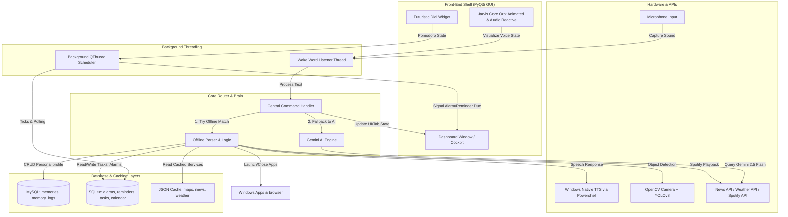
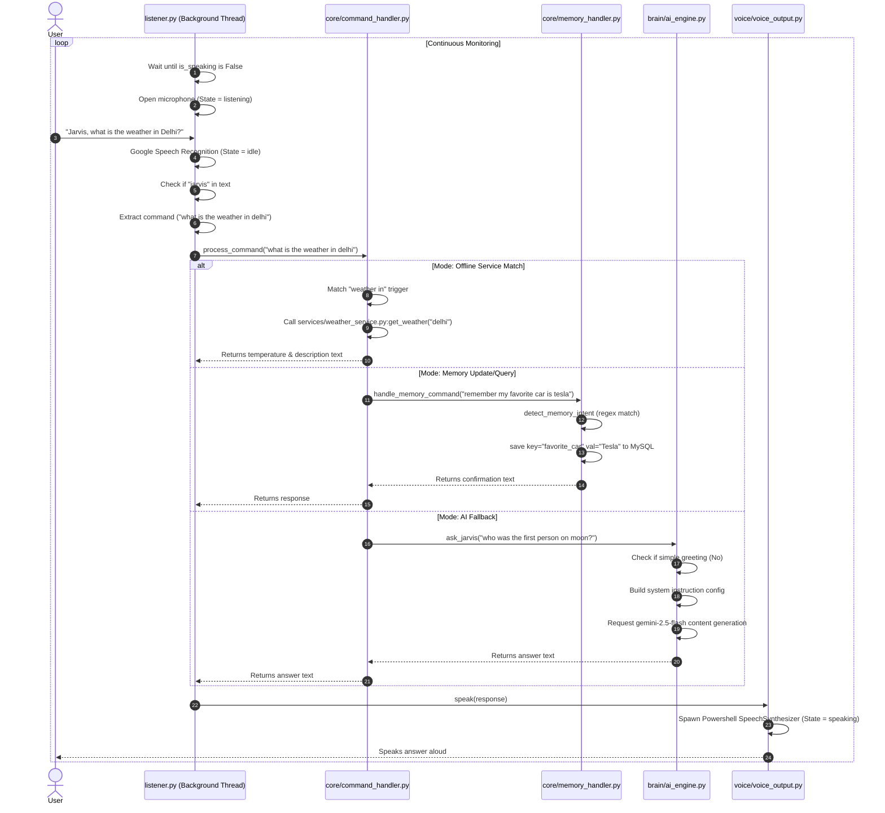

# JARVIS System Architecture & Walkthrough

Welcome back to the **JARVIS (Just A Rather Very Intelligent System)** project! This document provides a complete, top-to-bottom blueprint of how the system is currently designed, how components communicate, and how each subsystem operates under the hood.

---

## 1. System Architecture Overview

JARVIS is built as a multi-threaded, modular Python desktop assistant. It leverages a futuristic **PyQt5 GUI** as its primary front-end shell (the "Cockpit"), a **Speech Recognition loop** in the background, a **MySQL-backed persistent memory system**, and a central **offline-first command handler** that falls back to **Gemini 2.5 Flash** for advanced intelligence.

### High-Level Components



---

## 2. Core Execution Flow

The system runs on three primary execution contexts to prevent GUI blocking and maintain audio-responsiveness:
1. **Main Thread**: Boots up databases, starts background worker threads, and launches the PyQt5 event loop.
2. **Wake Word Listener Thread**: A background `threading.Thread` that manages the microphone capture loop.
3. **Background Scheduler Thread**: A background PyQt `QThread` running a 1-second interval loop tracking alarms, reminders, Pomodoro states, and countdown timers.

### Startup Lifecycle (`main.py`)

1. **Memory Initialization**: First, `main.py` imports `database/mysql_connector.py` and initializes the MySQL connection pool. It loads all records from the `memories` table into the in-memory cache of `MemoryManager`.
2. **Wake Listener Activation**: Spawns a daemon thread running `listener.py:wake_listener()`.
3. **GUI Cockpit Launch**: Invokes `gui/main_window.py:launch_gui()`, which initializes the PyQt5 application, constructs the `DashboardWindow`, and opens the interface on screen.

### Voice Loop & Command Execution (`listener.py` & `core/command_handler.py`)



---

## 3. Directory & Subsystem Walkthrough

### 📁 `core/` (Command Routing & Intent Parsing)
- **`command_handler.py`**: The central switchboard. The `process_command(user_text)` function converts commands to lowercase and checks them against rules in a priority sequence:
  1. **Reminders & Alarms**: NLP text triggers (e.g. "remind me to...") route to `reminder_service.py` or the SQLite DB, opening the correct dashboard tab.
  2. **Productivity cockpit tabs**: Voice requests like "open tasks" or "show calendar" switch PyQt tabs on the main window.
  3. **Applications**: Matches patterns like "open notepad" or "close chrome" and executes them.
  4. **Maps**: Detects zoom triggers or location requests ("locate Delhi", "directions from A to B") and opens interactive maps.
  5. **Memory System**: Sends user properties to the memory engine.
  6. **Local offline queries**: Answers questions like "who am I" or "what is the time" offline using cached metadata or `time_service.py`.
  7. **APIs**: Routes Spotify controls ("play music", "next song"), Weather forecasts ("weather in Delhi"), or News topics ("news about Tesla").
  8. **Gemini Fallback**: Anything unmatched goes to `ask_jarvis(user_text)`.
- **`memory_handler.py`**: Implements memory operations (SAVE, UPDATE, READ, DELETE, LIST). Features a global `_pending` confirmation state dictionary. If you say "remember my home city is Mumbai" but it's currently set to "Delhi", it triggers a confirmation prompt: *"Your home city is currently set to Delhi. Would you like me to update it to Mumbai?"* and holds execution until you say "yes" or "no".

### 📁 `brain/` & `memory/` (AI & User Personalization)
- **`ai_engine.py`**: Integrates with the **Gemini Developer API** using the modern `google-genai` SDK.
  - Keeps a static mapping of offline greetings (hello, who are you, thanks, good morning/night) to save cloud API quota.
  - Dynamically constructs a `system_instruction` text list, injecting the user's real name (loaded from local cache) so Gemini knows exactly who it is talking to, and enforcing the JARVIS persona constraints (e.g., never identify as Google AI or Gemini).
- **`memory_intent.py`**: A fast, regex-based offline analyzer that parses memory sentences before invoking the LLM. It maps natural phrases to canonical snake_case variables using `KEY_ALIASES` (e.g. "hometown" -> `home_city`, "email address" -> `email`) and categorizes them (`personal`, `education`, `preferences`, `projects`, etc.).
- **`memory_manager.py`**: A thread-safe, in-memory cached manager for user memories.
  - `initialize()` pulls all key-value rows from MySQL at startup.
  - Operates updates with thread locks (`self._lock = threading.Lock()`) and performs database writes.
  - Log audit rows are written to a `memory_logs` table for database change-tracking.
  - Integrates backwards-compatibility mapping to `owner_profile.py`.
- **`owner_profile.py`**: Houses the dynamic `OWNER_DATA` dictionary, supplying immediate offline answers to files looking for user parameters.

### 📁 `database/` (Data Storage & Caching Layers)
- **`mysql_connector.py`**: Connects to the local MySQL server using connection pooling (`mysql.connector.pooling`). It handles automated database setup: if the `jarvis_memory` schema is missing, it creates it along with two InnoDB tables:
  - `memories`: Keys, values, category, creation/updated timestamps.
  - `memory_logs`: Changes tracker showing old values vs new values.
- **`db_manager.py`**: Standard SQLite manager for `jarvis_productivity.db`. Creates the relational schema for the Productivity Cockpit:
  - `alarms`: Alarm times, volume levels, repeats, custom sound files.
  - `reminders`: Due date, completed flags, and repeat rules.
  - `tasks`: Core database behind the Kanban visual board (title, desc, priority, tags, status: `todo`/`doing`/`done`).
  - `events`: Full relational calendar support (start/end times, hex color, category).
  - `timer_logs`: Focus duration details for analytics graphs.
  - `settings`: Key-value registry for UI themes, short/long break intervals.

> [!NOTE]
> **Active vs. Legacy Databases**:
> - **Active**: Alarms, Reminders, Tasks, and Settings are read from and written to `database/jarvis_productivity.db` (managed by `db_manager.py`).
> - **Legacy**: `database/reminders_db.py` (which writes to `database/reminders.db`) and `scheduler/reminder_scheduler.py` are legacy components from an early development phase and are no longer connected to the active voice listener or dashboard panels.

---

## 4. Services & API Integrations

### Interactive Leaflet Maps (`services/map_service.py`)
Provides voice-controlled 2D, 3D, and 4D maps:
- Spawns a local python `ThreadingHTTPServer` at `http://127.0.0.1:8765` serving the HTML/JS maps from the `/maps` directory.
- Resolves location geocoding by contacting OpenStreetMap Nominatim APIs.
- Calculates road routes using OSRM driving APIs.
- **Aggressive caching**: Locations are indexed in `memory/map_cache.json` and routes in `memory/route_cache.json` to prevent server bans and load maps instantly.
- Opens the browser automatically using `webbrowser.open()`.

### News Service RSS Aggregator (`services/news_services.py`)
- Standard queries route to NewsAPI.
- The UI feed utilizes an offline RSS caching system. It downloads XML feeds from BBC, Reuters, Al Jazeera, Google News, and Times of India, parses them using standard `xml.etree.ElementTree`, extracts titles, descriptions, and thumbnail links, and stores them in `database/news_cache.json`.
- Downloads thumbnail images locally into `database/news_images/` using MD5 hashes of the URLs.
- Checks cache ages (`is_news_cache_expired`) on ticks to only pull RSS updates every 30 minutes.

### Weather System (`services/weather_service.py`)
- Communicates with OpenWeatherMap API using a key stored in the `.env` file.
- Classifies conditions into general classes (e.g. `clear_day`, `clear_night`, `clouds`, `rain`, `mist`) based on sunrise/sunset limits and keyword matching.
- Caches the current weather locally in `database/weather_cache.json` to reduce redundant API calls.

---

## 5. Front-End PyQt5 UI Components (`gui/`)

The GUI is a highly customized glassmorphic UI matching a futuristic cockpit theme.

### Interactive Widgets & Animations
- **`dashboard_window.py`**: The parent shell. Houses the left sidebar containing glowing navigation buttons and coordinates the central `QStackedWidget` tabs.
- **`dashboard_tab.py`**: The main page. Groups world clocks, the Pomodoro widget, stats cards, a compact weather widget, and headlines.
- **`clock_widgets.py`**: Contains advanced custom painter widgets:
  - `FuturisticDial`: Renders a circular dial using radial gradients, glowing pen widths, rotating dashed tick marks, and customizable arcs for Pomodoro and timer countdowns.
  - `JarvisCoreGlyph`: The central animated core orb. It retrieves the assistant state from `gui/gui_state.py` and the live microphone volume from `audio_reactive.py`. It dynamically paints a morphing circular path using sine/cosine waves and updates its glow colors:
    - **Listening**: Neon Green (`#00ff78`)
    - **Speaking**: Neon Blue/Cyan (`#00aaff`)
    - **Idle**: Neon Red (`#ff2828`)
- **`tasks_tab.py`**: A fully functional visual Kanban board. Organizes tasks into "To Do", "Doing", and "Done" columns. Supports drag-and-drop actions, manual registration, and voice task creation.

---

## 6. Voice, Vision & NLP Mechanics

### Text-To-Speech Output (`voice/voice_output.py`)
- To prevent SAPI system locks, SAPI is triggered via subprocesses rather than active library bindings.
- When `speak(text)` is called, a daemon thread is created which starts a PowerShell subprocess executing native Windows synthesis commands:
  ```powershell
  Add-Type -AssemblyName System.Speech;
  $speak = New-Object System.Speech.Synthesis.SpeechSynthesizer;
  $speak.Speak("Response Text");
  ```
- Speech can be aborted instantly via `stop_speaking()`, which executes a `.terminate()` command on the active PowerShell subprocess.

### Computer Vision (`vision/vision_detector.py`)
- Employs OpenCV to open the webcam (`cv2.VideoCapture(0)`).
- Captures a **single frame** and immediately releases the camera so other apps can access the hardware.
- Feeds the frame through **YOLOv8** (`yolov8n.pt`).
- Extracts class indexes, maps them to labels, filters duplicates, and return a clean array of identified items.

### Date-Time Parsing (`utils/nlp_parser.py`)
Translates speech to times and dates using regex patterns:
- **Relative durations**: Matches strings like *"in 5 minutes"* or *"in an hour"*, converting them to `datetime.now() + timedelta()`.
- **Clock Times**: Searches for 12h or 24h formats (e.g. `"7:30 pm"`, `"noon"`, `"midnight"`, `"at 7"`), applying afternoon heuristics if no AM/PM indicator is given.
- **Calendar Dates**: Translates expressions like `"tomorrow"`, `"day after tomorrow"`, `"next Monday"`, or specific weekdays.
- **Label Extraction**: Strips parsed timing elements from the raw string to isolate the clean description for the database.
